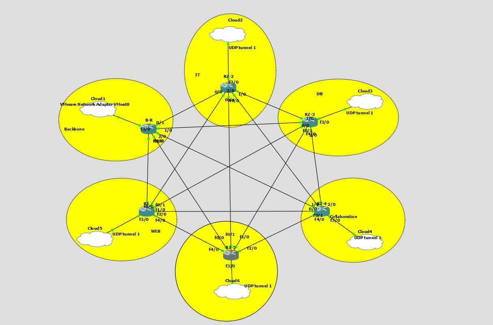

# 🏢 TechSolutions SARL – Network & Security Documentation


---

## 📌 Présentation
Ce dépôt contient la **documentation officielle** du projet de conception et de déploiement
d’une **infrastructure réseau sécurisée** pour l’entreprise **TechSolutions SARL**.

Le projet simule un environnement d’entreprise réel intégrant :
- un backbone OSPF
- plusieurs départements fonctionnels
- des services sur machines virtuelles
- un mécanisme de sécurité basé sur un VPN

---

## 🧩 Architecture générale
- Backbone OSPF (topologie maillée)
- Départements indépendants (VLSM)
- Routeur Internet avec NAT
- VPN pour la sécurisation des flux internes

📸 *Schémas et captures disponibles dans le dossier `documentation/`*

---

## 📂 Contenu du dépôt

| Fichier | Description |
|------|-----------|
| `cahier-des-charges.md` | Contexte, objectifs et périmètre du projet |
| `materiels.md` | Matériels et outils utilisés |
| `topologie.md` | Description de la topologie réseau |
| `securite.md` | Sécurité réseau (VPN) |
| `documentation/` | Captures GNS3 et schémas |

---

## 🛠️ Technologies & Outils
- GNS3
- Routeurs virtuels (Cisco IOS-like)
- Machines virtuelles Linux
- OSPF
- VLSM
- NAT / PAT
- VPN site-à-site

---

## 🔐 Sécurité
La sécurité du réseau repose sur la mise en place d’un **VPN** entre le backbone et les
différents départements afin d’assurer la confidentialité des communications internes.

📘 Détails : [`Securite.md`](./Securite.md)

---

## 👤 Rôle & responsabilités
**Responsable coordination, documentation & sécurité :**  
➡️ *Mehdi Ghribi*

---

## 📸 Aperçu
*(Ajouter ici une capture principale de la topologie)*

## 📜 Licence
Projet académique – sous licence MIT.


```md

